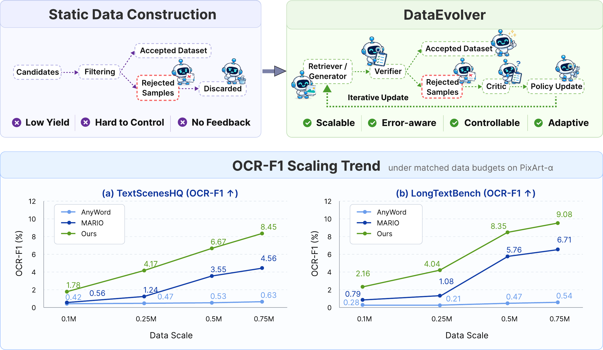
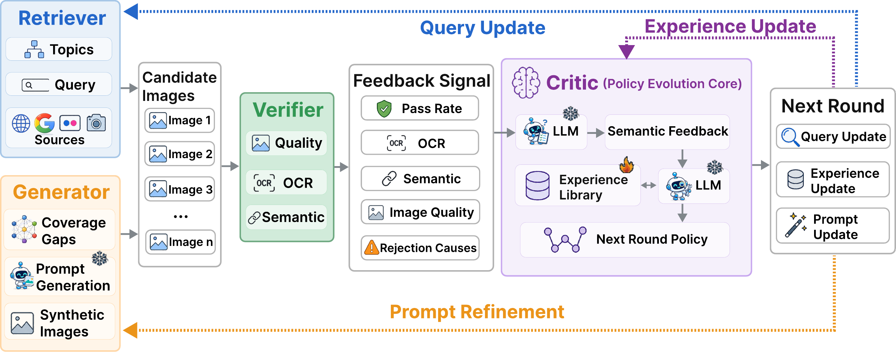

# DataEvolver: Self-Evolving Multi-Agent Data Construction for Text-Rich Image Generation

<p align="center">
  <a href="https://sgysy.github.io/">Siyu Yan</a><sup>1,2,*</sup>&nbsp;&nbsp;
  <a href="#">Yizhen Gao</a><sup>1,*</sup>&nbsp;&nbsp;
  <a href="#">Yilin Wang</a><sup>1</sup>&nbsp;&nbsp;
  <a href="#">Dongxing Mao</a><sup>1</sup>&nbsp;&nbsp;
  <a href="https://fingerrec.github.io/">Alex Jinpeng Wang</a><sup>1,†</sup>
</p>

<p align="center">
  <sup>1</sup>Central South University&nbsp;&nbsp;&nbsp;
  <sup>2</sup>The Hong Kong University of Science and Technology<br>
  <sup>*</sup>Equal contribution&nbsp;&nbsp;&nbsp;
  <sup>†</sup>Corresponding author
</p>

<p align="center">
  <a href="#"></a>
  <a href="https://sgysy.github.io/dataevolver/"></a>
  <a href="LICENSE"></a>
  
</p>

<p align="center">
  <a href="https://sgysy.github.io/dataevolver/">Project Page</a>
</p>

---

<p align="center">
  
</p>

## Overview

**DataEvolver** is a self-evolving multi-agent data construction framework for text-rich image generation. Instead of following a static *crawl → filter → freeze* pipeline, DataEvolver treats rejected samples as feedback signals and uses them to improve subsequent construction rounds.

The key idea is simple: **rejected samples should not be discarded silently; they should guide the next round of retrieval, filtering, and generation.** Construction-time failures, including OCR errors, semantic mismatches, duplicates, and topic coverage gaps, are converted into actionable feedback for policy revision.

## Framework

DataEvolver is organized as a closed-loop construction process with four cooperative agents.

<table>
  <thead>
    <tr>
      <th width="24%">Agent</th>
      <th width="48%">Role</th>
      <th width="28%">Backend</th>
    </tr>
  </thead>
  <tbody>
    <tr>
      <td width="24%">🔍&nbsp;<b>Retriever</b></td>
      <td width="48%">Discovers candidate images with optimized search queries and updates query strategies using feedback from previous rounds.</td>
      <td width="28%"><code>Mistral-7B</code></td>
    </tr>
    <tr>
      <td width="24%">✅&nbsp;<b>Verifier</b></td>
      <td width="48%">Filters candidates through OCR quality, duplicate detection, semantic relevance, and text consistency checks.</td>
      <td width="28%"><code>PaddleOCR</code> + <code>CLIP</code> + <code>Sentence-Transformers</code></td>
    </tr>
    <tr>
      <td width="24%">📊&nbsp;<b>Critic</b></td>
      <td width="48%">Summarizes rejection patterns into semantic feedback, maintains an experience library, and revises construction policies.</td>
      <td width="28%"><code>Qwen3.5-4B</code></td>
    </tr>
    <tr>
      <td width="24%">🎨&nbsp;<b>Generator</b></td>
      <td width="48%">Identifies under-represented categories and synthesizes text-aware images to improve topic coverage.</td>
      <td width="28%"><code>Qwen3-VL</code></td>
    </tr>
  </tbody>
</table>

```text
Round t:
  Retriever → Verifier → Accepted Dataset
                    ↓
              Rejected Samples
                    ↓
          Critic → Semantic Feedback → Policy Update
                    ↓
Round t+1:
  Revised Queries / Prompts / Thresholds → Retriever → ...
```

<p align="center">
  
</p>

## Highlights

- **Feedback-driven construction:** rejection causes are converted into semantic feedback rather than being discarded.
- **Closed-loop policy revision:** retrieval queries, generation prompts, and filtering thresholds are updated across construction rounds.
- **Targeted data completion:** the Generator synthesizes samples for under-represented text-rich image categories.
- **Traceable construction process:** accepted samples preserve query, caption, OCR, quality, semantic, and filtering metadata.

## Results

On **PixArt-α** at the **0.75M** data scale, DataEvolver improves OCR-F1 over the strongest matched-budget baseline.

| Evaluation Set | Relative OCR-F1 Improvement |
| --- | ---: |
| TextScenesHQ | +85.3% |
| LongTextBench | +35.3% |

Ablation studies show that both the **Critic** and the **Generator** contribute to the final performance, indicating that feedback-based policy revision and targeted completion are both necessary for effective text-rich data construction.

## Getting Started

### 1. Clone the repository

```bash
git clone https://github.com/sgysy/dataevolver.git
cd dataevolver
```

### 2. Install dependencies

```bash
pip install -r requirements.txt
```

### 3. Run the pipeline

```bash
bash run.sh
```

## Configuration

All major settings are controlled by `config.yaml`.

<details>
<summary><b>Paths</b> — data, logs, and output directories</summary>

```yaml
paths:
  images_crawled: "/path/to/crawled/images"
  images_generated: "/path/to/generated/images"
  ann_dir: "/path/to/annotations"
  log_dir: "/path/to/logs"
  accepted_dir: "/path/to/accepted"
  gen_dir: "/path/to/generated/raw"
  gen_accepted_dir: "/path/to/gen/accepted"
```

</details>

<details>
<summary><b>LLM & Agent Models</b> — Ollama-compatible local models</summary>

```yaml
llm:
  model: "mistral:latest"          # Retriever / query planning / count analysis
  cir_model: "qwen3.5:4b"          # Critic / semantic feedback / experience library
```

All LLM backends are served through Ollama. You can replace them with other Ollama-compatible models according to your compute budget.

</details>

<details>
<summary><b>Topics & Seed Queries</b> — target domains for data construction</summary>

```yaml
topics:
  - name: Store_Signs_and_Shopfronts
    seed_queries:
      - "store signboard shop front"
      - "restaurant sign food street sign"
      - "Chinese shop plaque traditional signage"

  - name: Book_Covers
    seed_queries:
      - "book cover title author text"
      - "novel cover book jacket design"
```

Seed queries define the initial retrieval space. During construction, the Retriever and Critic refine these queries based on acceptance and rejection patterns.

</details>

## Quick Customization

1. Edit `paths` in `config.yaml`.
2. Define target `topics` and seed queries.
3. Choose Ollama-compatible LLM backends.
4. Adjust OCR, semantic, duplicate, and quality thresholds.
5. Enable or disable generation according to your experiment.
6. Run `bash run.sh`.

## Citation

If you find DataEvolver useful, please cite:

```bibtex
@article{yan2026dataevolver,
  title   = {DataEvolver: Self-Evolving Multi-Agent Data Construction for Text-Rich Image Generation},
  author  = {Yan, Siyu and Gao, Yizhen and Wang, Yilin and Mao, Dongxing and Wang, Alex Jinpeng},
  journal = {arXiv preprint},
  year    = {2026}
}
```

## Acknowledgments

This project builds on several open-source tools, including PaddleOCR, Ollama, Hugging Face Diffusers, Qwen-Image, OpenCLIP, and Sentence-Transformers.
